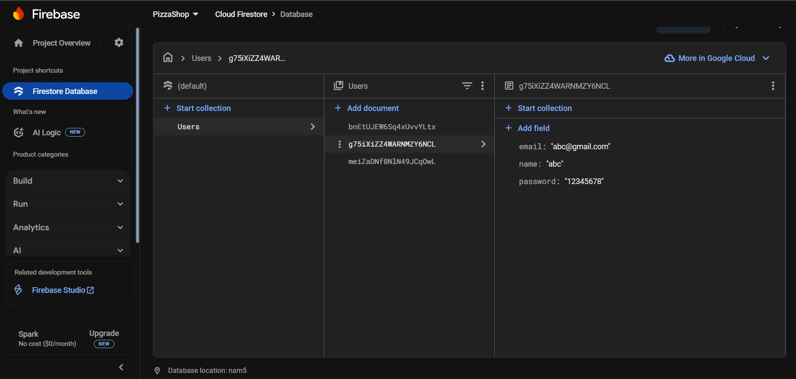
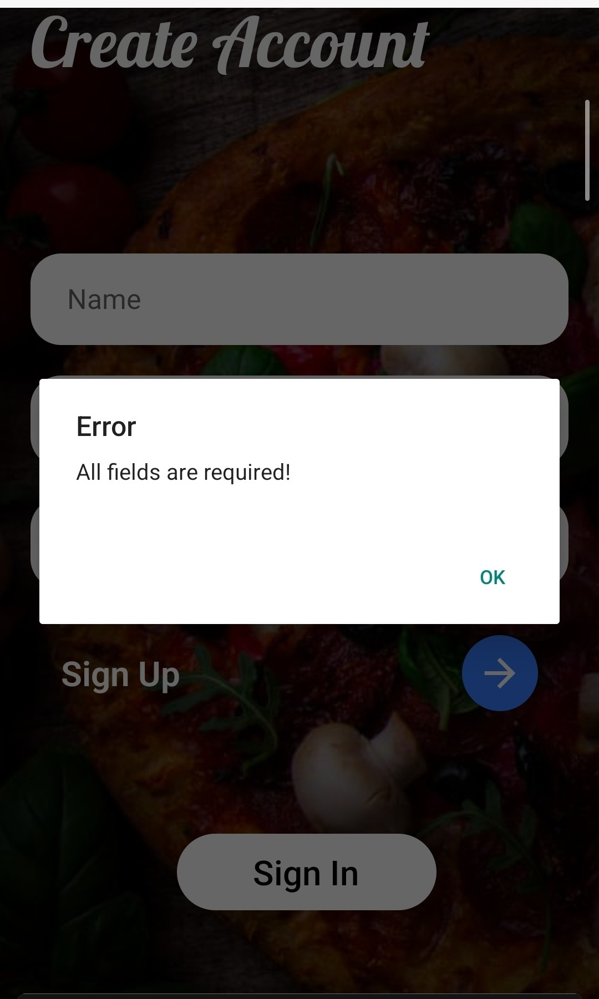
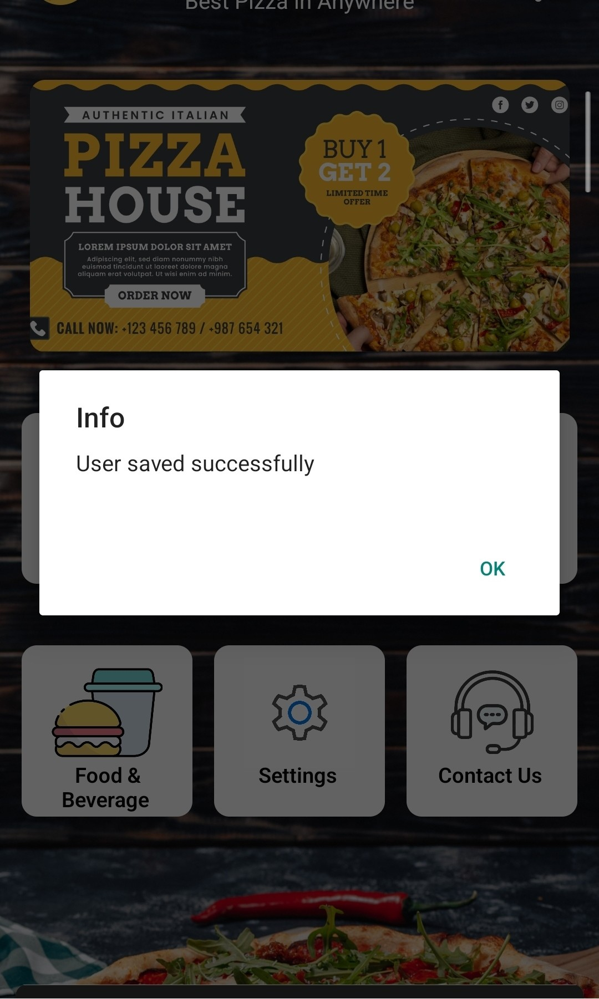
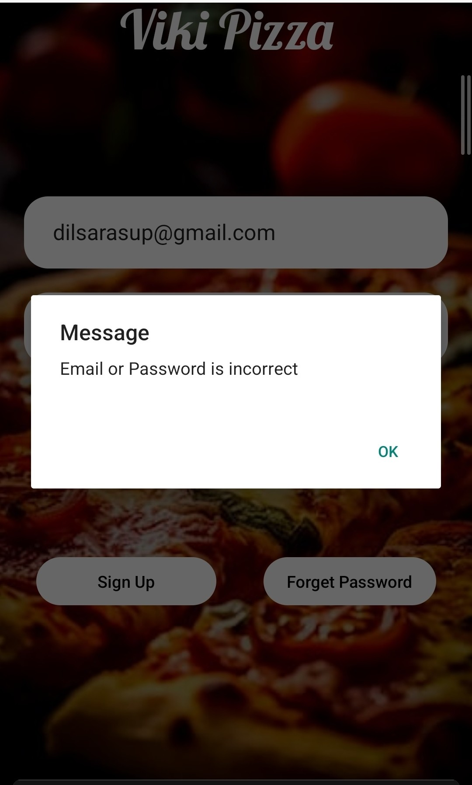

# PizzaHub

Welcome to PizzaHub - A React Native app for Viki Pizza! Visit [vikipizza.lk](https://vikipizza.lk) for more details.

## Description
This app allows users to browse menus, place orders, and manage their accounts.

## Features
- User authentication
- Menu browsing
- Order placement


## Screenshots
<table>
  <tr>
    <td></td>
    <td></td>
    <td></td>
  </tr>
  <tr>
    <td></td>
    <td></td>
    <td></td>
  </tr>
  <tr>
    <td></td>
    <td></td>
    <td></td>
  </tr>
</table>

This is a new [**React Native**](https://reactnative.dev) project, bootstrapped using [`@react-native-community/cli`](https://github.com/react-native-community/cli).

# Getting Started

> **Note**: Make sure you have completed the [Set Up Your Environment](https://reactnative.dev/docs/set-up-your-environment) guide before proceeding.

## Step 1: Start Metro

First, you will need to run **Metro**, the JavaScript build tool for React Native.

To start the Metro dev server, run the following command from the root of your React Native project:

```sh
# Using npm
npm start

# OR using Yarn
yarn start
```

## Step 2: Build and run your app

With Metro running, open a new terminal window/pane from the root of your React Native project, and use one of the following commands to build and run your Android or iOS app:

### Android

```sh
# Using npm
npm run android

# OR using Yarn
yarn android
```

### iOS

For iOS, remember to install CocoaPods dependencies (this only needs to be run on first clone or after updating native deps).

The first time you create a new project, run the Ruby bundler to install CocoaPods itself:

```sh
bundle install
```

Then, and every time you update your native dependencies, run:

```sh
bundle exec pod install
```

For more information, please visit [CocoaPods Getting Started guide](https://guides.cocoapods.org/using/getting-started.html).

```sh
# Using npm
npm run ios

# OR using Yarn
yarn ios
```

If everything is set up correctly, you should see your new app running in the Android Emulator, iOS Simulator, or your connected device.

This is one way to run your app — you can also build it directly from Android Studio or Xcode.

## Step 3: Modify your app

Now that you have successfully run the app, let's make changes!

Open `App.tsx` in your text editor of choice and make some changes. When you save, your app will automatically update and reflect these changes — this is powered by [Fast Refresh](https://reactnative.dev/docs/fast-refresh).

When you want to forcefully reload, for example to reset the state of your app, you can perform a full reload:

- **Android**: Press the <kbd>R</kbd> key twice or select **"Reload"** from the **Dev Menu**, accessed via <kbd>Ctrl</kbd> + <kbd>M</kbd> (Windows/Linux) or <kbd>Cmd ⌘</kbd> + <kbd>M</kbd> (macOS).
- **iOS**: Press <kbd>R</kbd> in iOS Simulator.

## Congratulations! :tada:

You've successfully run and modified your React Native App. :partying_face:

### Now what?

- If you want to add this new React Native code to an existing application, check out the [Integration guide](https://reactnative.dev/docs/integration-with-existing-apps).
- If you're curious to learn more about React Native, check out the [docs](https://reactnative.dev/docs/getting-started).

# Troubleshooting

If you're having issues getting the above steps to work, see the [Troubleshooting](https://reactnative.dev/docs/troubleshooting) page.


## How to Use Firebase in This Project

This project uses [@react-native-firebase](https://rnfirebase.io/) for Firebase integration. Follow these steps to set up Firebase in your local environment:

### Prerequisites
- A Firebase project created at [Firebase Console](https://console.firebase.google.com/).
- Node.js and npm installed.
- React Native environment set up (see `npx react-native doctor`).

### Steps to Configure Firebase

1. **Create a Firebase Project**
   - Go to the [Firebase Console](https://console.firebase.google.com/).
   - Click "Add project", name it (e.g., "PizzaHub"), and follow the setup wizard.

2. **Enable Required Firebase Services**
   - In the Firebase Console, enable:
     - Firestore (for database operations).
     - Authentication (if used).
     - Any other services your app requires (e.g., Cloud Functions).
   - Note the project settings for later.

3. **Install Firebase Dependencies**
   - Navigate to your project directory:
                                  - Install the required packages:
                                    (npm install @react-native-firebase/app @react-native-firebase/firestore)

4. **Configure Firebase in the Project**
- Download the Firebase configuration files:
- For Android: Download `google-services.json` from the Firebase Console (Project Settings > General > Your apps > Android app).
- For iOS: Download `GoogleService-Info.plist` (Project Settings > General > Your apps > iOS app).
- Place these files in the respective directories:
- `android/app/google-services.json`
- `ios/Runner/GoogleService-Info.plist` (adjust `Runner` to your iOS app name if different).
- Ensure these files are added to `.gitignore` to avoid committing them.

5. **Update FirebaseInit.ts**
- Open `src/firebase/FirebaseInit.ts` and replace the placeholder `firebaseConfig` with your project's configuration from the Firebase Console:
```typescript
import { initializeApp } from '@react-native-firebase/app';
import firestore from '@react-native-firebase/firestore';

const firebaseConfig = {
  apiKey: 'your-api-key',
  authDomain: 'your-auth-domain',
  projectId: 'your-project-id',
  storageBucket: 'your-storage-bucket',
  messagingSenderId: 'your-messaging-sender-id',
  appId: 'your-app-id',
};

const app = initializeApp(firebaseConfig);
export const db = firestore();
export default app;

              
                                   

